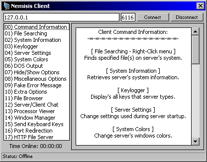



## Nemisis Client/Loader/Server

### Description

This is a remote admin I worked on a few years ago and ended up not touching it for another year. I am currently porting it to Delphi so while im doing that I figure I might as well post it to PSC. I guess in alot of ways its a trojan but I enjoy making these kinds of programs and I think any VB coder can get something from this cause I hit on almost everything invovled in VB at somepoint while making this code. It took me a long time to make so I hope you guys at least check it out. It may have some errors I havent looked at it in years and probably wont be updating it so feel free to do whatever you want with this code. This zip contains the Client, Server and a Loader which does all the bad things like installing it into your computer and hiding it and such so dont worry about running the Server just watch out with the Loader. Any comments would really be appriciated unless its just trojan bashing.
 
### More Info
 

             |
---                |---
**Submitted On**   |2004-03-24 07:56:28
**By**             |[Dustin Brett](https://github.com/Planet-Source-Code/PSCIndex/blob/master/ByAuthor/dustin-brett.md)
**Level**          |Advanced
**User Rating**    |5.0 (30 globes from 6 users)
**Compatibility**  |VB 3\.0, VB 4\.0 \(32\-bit\), VB 5\.0, VB 6\.0
**Category**       |[Complete Applications](https://github.com/Planet-Source-Code/PSCIndex/blob/master/ByCategory/complete-applications__1-27.md)
**World**          |[Visual Basic](https://github.com/Planet-Source-Code/PSCIndex/blob/master/ByWorld/visual-basic.md)
**Archive File**   |[Nemisis\_Cl18217411252004\.zip](https://github.com/Planet-Source-Code/dustin-brett-nemisis-client-loader-server__1-57410/archive/master.zip)

